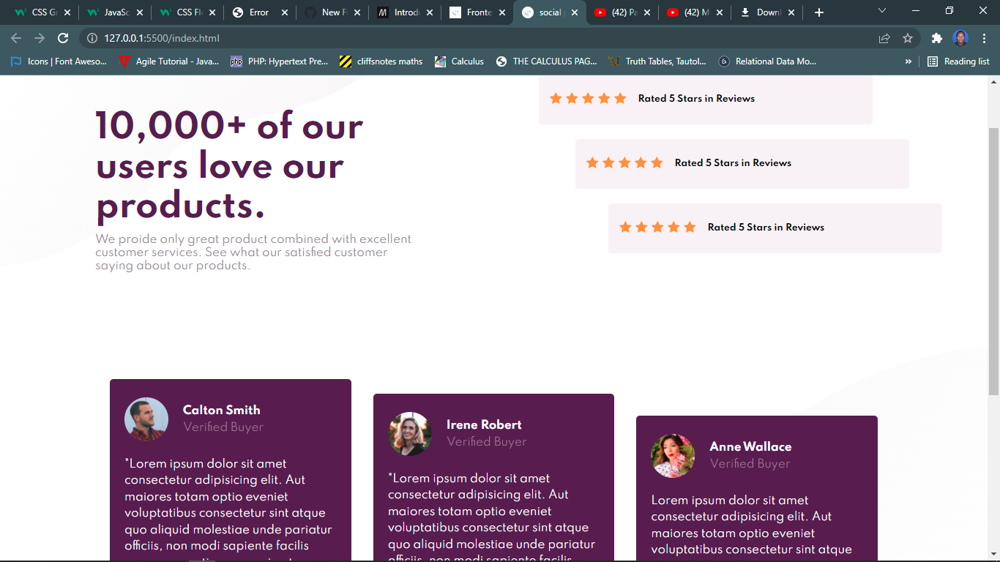
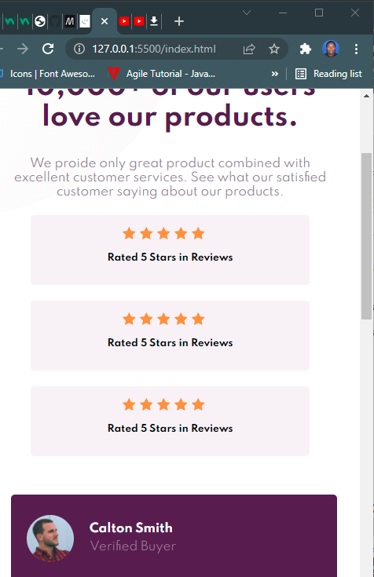

# Frontend Mentor - Social proof section solution

This is a solution to the [Social proof section challenge on Frontend Mentor](https://www.frontendmentor.io/challenges/social-proof-section-6e0qTv_bA). Frontend Mentor challenges help you improve your coding skills by building realistic projects. 

## Table of contents

- [Overview](#overview)
  - [The challenge](#the-challenge)
  - [Screenshot](#screenshot)
  - [Built with](#built-with)
  - [Useful resources](#useful-resources)
- [Author](#author)

## Overview

### The challenge

Users should be able to:

- View the optimal layout for the section depending on their device's screen size

### Screenshot

### Desktop view

### Mobile view

### Links

- Solution URL: [Add solution URL here](https://your-solution-url.com)
- Live Site URL: [Add live site URL here](https://your-live-site-url.com)

## My process

### Built with

- Semantic HTML5 markup
- CSS custom properties
- Flexbox
- CSS Grid
- Mobile-first workflow

### Useful resources

- [W3school](https://www.w3school.com) - This helped me for to clear understand HTML and CSS. I really liked this site.
- [Stackoverflow](https://www.stackoverflow.com) - This is an amazing site which helped me finally understand css grid. I'd recommend it to anyone still learning this concept.

## Author

- Website - [uplinking.com](https://www.uplinking.com)
- Frontend Mentor - [@adam434512](https://www.frontendmentor.io/profile/adam434512)
